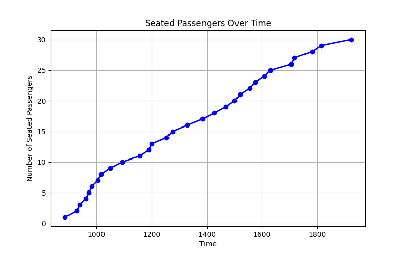
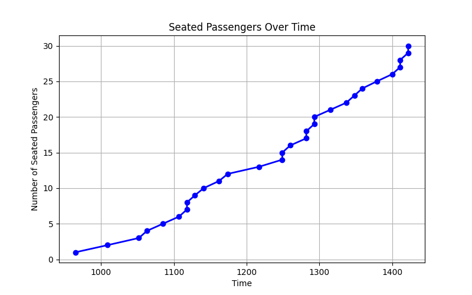

# Simulace usazování pasažérů do letadla
Cílem projektu je nasimulovat různé podmínky ovlivňující rychlost usazování pasažérů v letadle

**_Autoři: Michal Průšek, Kateřina Morovicsová, Filip Širc_**

## Funkce

- **Dynamická Simulace Nástupu**: Pasažéři jsou spawnováni na vybraných dveřích (vybere uživatel) a pohybují se směrem ke svým přiřazeným sedadlům.
- **Manipulace se Zavazadly**: Pasažéři mohou mít zavazadla s pravděpodobností (p=0.6), která potřebují uložit před usednutím na sedadlo. Čas uložení se sampluje ze uniformního rozdělení na celých číslech (3,5) 
- **Řešení Konfliktů**: Simulace zvládá situace, kdy více pasažérů chce vstoupit do stejné buňky, dle kódu z přednášky.
- **Přizpůsobitelné Parametry**: Umožňuje nastavení počtu řad sedadel, počtu sedadel v každé sekci, volby dveří pro spawnování pasažérů, pravděpodobnosti, že pasažér má zavazadlo, a rychlosti simulace. Matice letadla se pak generuje adaptivně na základě prvních dvou zmíněných parametrů.
- **Vizualizace v reálném čase**: Vizualizace procesu nástupu pomocí Pygame, zobrazující pasažéry, sedadla, uličky a dveře.
- **Progress Bar**: Zobrazuje informace o celkovém počtu pasažérů, sedadel, pasažérů čekajících na spawnování a pasažérů aktuálně v simulaci.
- **Různé strategie usazování**: Umožňuje nastavit strategii, se kterou jsou uživatelé usazování do letadla.

## Jak To Funguje

### 1. Třída `Airplane`

- **Účel**: Spravuje matici letadla, včetně uspořádání sedadel, zdí a dveří.
- **Inicializace**: Nastavuje parametry letadla a vytváří matici reprezentující rozložení letadla.
- **Matice Letadla**: Používá NumPy matici k reprezentaci uspořádání, kde různé hodnoty odpovídají zdí, uličkám, sedadlům a dveřím.

### 2. Třída `Passenger`

- **Účel**: Reprezentuje jednotlivé pasažéry v simulaci.
- **Atributy**:
  - `ped_id`: ID pasažéra.
  - `current_pos`: Aktuální pozice pasažéra v matici.
  - `seat_pos`: Přiřazená pozice sedadla.
  - `has_baggage`: Informace o tom, zda pasažér má zavazadlo.
  - `baggage_steps_remaining`: Počet kroků potřebných k uložení zavazadla.
  - `seated`: Stav, zda je pasažér již usazen.
  - `desired_move`: Pozice, kam se pasažér chce posunout, ale je obsazená.
  - `swapping`: Stav, kdy se pasažér vyměňuje s jiným pasažérem..
  - `swapping_speed`: Rychlost výměny při vyměňování v uličce.
  - `swapping_progress`: Počet kroků potřebných k dokončení výměny.
  - `seating_in_progress`: Informace, zda se uživatel dostává ke svému sedadlu přes již usazené pasažéry.
  - `seating_steps_remaining`: Doba usazování závisí na počtu "blokujících sedadel".

- **Logika Pohybu**:
  - Pasažéři se rozhodují o svém dalším kroku na základě nejkratší cesty k sedadlu.
  - Pokud má pasažér zavazadlo, zastaví se a uloží ho před pokračováním k sedadlu.
  - Konfliktní situace jsou řešeny tak, že pouze jeden pasažér může vstoupit do konkurenční buňky najednou.
  - Pokud jdou dva pasažéři proti sobě, vymění se.
  - Pokud se chce uživatel usadit k oknu přes již obsazené místo v uličce, usazení trvá delší dobu. Po dobu usazování je ulička blokovaná
  
### 3. Třída `Simulation`

- **Účel**: Řídí celou simulaci, včetně inicializace letadla, pasažérů a vizualizace pomocí Pygame.
- **Inicializace**: Nastavuje prostředí simulace, včetně rozměrů okna Pygame, barev, fontů a časování.
- **Strategie usazování**:
  - `random`: Pasážeři jsou spawnování s náhodným sedadlem
  - `window_wise`: Pasažéři jsou spawnováni tak, aby přednost měli Ti se sedadlem u okna".
  - `door_wise`: Pasažéři jsou spawnováni tak, aby předními dveřmi šli Ti se sedadlem v přední části letadla".
  - `door_wise`: Pasažéři jsou spawnováni tak, aby předními dveřmi šli Ti se sedadlem v přední části letadla a přednost měli Ti se sedadlem u okénka".

- **Metody**:
  - `draw_grid`: Vykresluje matici letadla a pasažéry na obrazovce.
  - `spawn_passengers`: Spawnuje nové pasažéry na dveřích, pokud jsou buňky dveří volné a jsou k dispozici sedadla.
  - `resolve_conflicts`: Řeší konflikty, kdy více pasažérů chce vstoupit do stejné buňky, tím, že náhodně vybere jednoho, který může pokračovat.
  - `resolve_swapping`: Řeší konflikty, kdy jdou dva pasažéri proti sobě a musi se vyměnit v uličce.
  - `run`: Hlavní smyčka simulace, která zpracovává události, spawnuje pasažéry, aktualizuje jejich pohyb, vykresluje scénu a kontroluje ukončení simulace.

### 4. Funkce `compute_distance_matrix`

- **Účel**: Vypočítává matici vzdáleností od každé buňky v letadle ke konkrétnímu sedadlu pomocí algoritmu Breadth-First Search (BFS).
- **Parametry**:
  - `matrix`: Matice reprezentující uspořádání letadla (zdí, uliček, sedadel).
  - `seat_pos`: Pozice cílového sedadla.
- **Výstup**: Matice vzdáleností, kde každá buňka obsahuje minimální počet kroků potřebných k dosažení cílového sedadla.

## Vizualizace

- **Okno Pygame**: Zobrazuje horní bar s informacemi o simulaci a samotný grid letadla, kde různé barvy reprezentují různé prvky (zdi, uličky, sedadla, dveře, pasažéry).
- **Pasažéři**:
  - **Oranžová**: Aktivní pasažéři, kteří se pohybují k sedadlům.
  - **Zelená**: Usazení pasažéři.
  - **Azurová**: Pasažéři ukládající zavazadla.
  - **Červená**: Pasažéři, kteří se právě usazují - dostávají ke svému zablokovanému sedadlu
  - **Růžová**: Pasažéři, kteří se právě vyměňují v uličce.
- **Zavazadlo**: Pasažéři, kteri u sebe maji male příruční zavazadlo (zobrazeno modrým čtverečkem).

## Ukončení Simulace

Simulace se ukončí, když jsou všichni pasažéři spawnováni a usazeni na svých sedadlech.

## Zobrazení statistik
Po ukončení simulace se vygeneruje graf ukazující usazování jednotlivých pasažérů v čase.

    <figure align="center">
      
      <figcaption align="center">(Obr. 1) Náhodné usazování pasažérů</figcaption>
    </figure>
    <figure align="center">
      
      <figcaption align="center">(Obr. 2) Usazování při zohlednění polohy sedadel vůči oknům a dveřím</figcaption>
    </figure>

